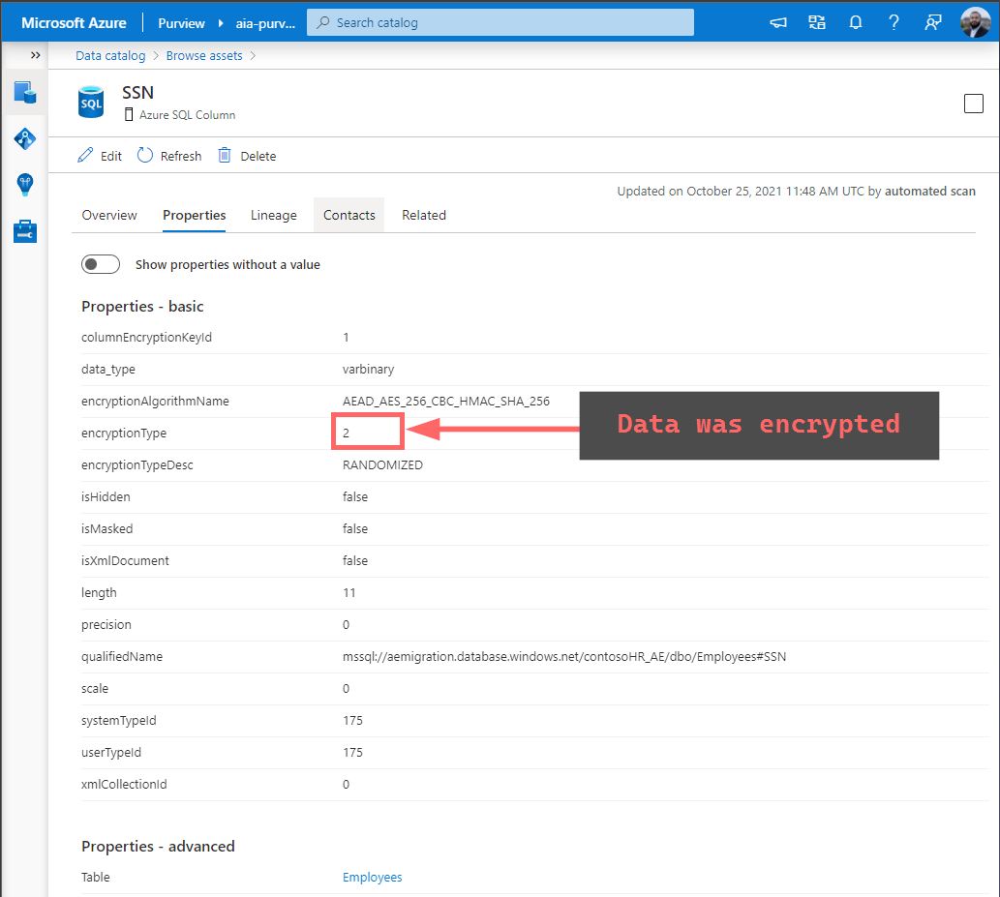

# Azure Purview - Containerized app for receiving custom notifications upon classification drift <!-- omit in toc -->

A containerized [Python app streaming Event Hub logs](https://docs.microsoft.com/en-us/azure/event-hubs/event-hubs-python-get-started-send) that monitors [Atlas Hook](https://atlas.apache.org/2.0.0/Notifications.html) to implement Business Logic as custom alerts.

## Table of Contents <!-- omit in toc -->

- [Overview](#overview)
  - [Sample Business specific data classification mapping logic](#sample-business-specific-data-classification-mapping-logic)
  - [Sample Alert Rules](#sample-alert-rules)
- [Pre-reqs](#pre-reqs)
- [Run container on Docker Desktop](#run-container-on-docker-desktop)
- [Run container on Kubernetes](#run-container-on-kubernetes)
- [Demonstration](#demonstration)
  - [`ALERT-002`: App team declared incorrect initial state by classifying one of the column incorrectly](#alert-002-app-team-declared-incorrect-initial-state-by-classifying-one-of-the-column-incorrectly)
  - [`ALERT-001`: App team has decrypted sensitive column - detected data classification `Contoso_IC_Sensitive`](#alert-001-app-team-has-decrypted-sensitive-column---detected-data-classification-contoso_ic_sensitive)
- [Additional Resources](#additional-resources)

## Overview

### Sample Business specific data classification mapping logic

| Classification Type                              | Description               | Internal Classification Code | Classification | Must store as encrypted? |
| ------------------------------------------------ | ------------------------- | ---------------------------- | -------------- | ------------------------ |
| `MICROSOFT.PERSONAL.NAME`                        | Person's name             | Contoso_IC_Confidential      | Classified     | No                       |
| `MICROSOFT.PERSONAL.US.PHONE_NUMBER`             | Phone number              | Contoso_IC_Confidential      | Classified     | No                       |
| `MICROSOFT.PERSONAL.EMAIL`                       | Email                     | Contoso_IC_Confidential      | Classified     | No                       |
| `MICROSOFT.FINANCIAL.CREDIT_CARD_NUMBER`         | Credit Card               | Contoso_IC_Sensitive         | Sensitive      | **Yes**                  |
| `MICROSOFT.GOVERNMENT.US.SOCIAL_SECURITY_NUMBER` | US Social Security number | Contoso_IC_Sensitive         | Sensitive      | **Yes**                  |

### Sample Alert Rules

| Alert Code  | Cause                                                              | Action                                                       | Comments                                                                                                                                                                                                                                                                                                      |
| ----------- | ------------------------------------------------------------------ | ------------------------------------------------------------ | ------------------------------------------------------------------------------------------------------------------------------------------------------------------------------------------------------------------------------------------------------------------------------------------------------------- |
| `ALERT-001` | Detected data classification `Contoso_IC_Sensitive` in sample data | Data must be encrypted by app team                           | Our business logic above dictates App Teams must store **Sensitive** data in an encrypted format. Purview has detected unencrypted data that was classified as Sensitive - therefore the alert.                                                                                                               |
| `ALERT-002` | Detected schema classification does not match the declared state   | App Team must change declared classification to match actual | Our desire is to always ensure the declared classification state (by the app team upon data onboarding) always matches the actual classification state of the data (determined by Purview via continuous scans). Purview has detected a drift between the **declared vs actual state** - therefore the alert. |

## Pre-reqs

- Follow the steps [here](https://www.rakirahman.me/purview-sql-cle-events-with-kafdrop/) to set up a sample database
- Follow the steps [here](https://github.com/mdrakiburrahman/purview-asset-ingestor) to declare the initial asset classification state using the custom minified payload defined in the repo

## Run container on Docker Desktop

Clone this repo - then to run the container locally on Docker Desktop, run:

```powershell
# Build container from Dockerfile
docker build -t purview-classification-drift-notifier .

# Start container by injecting environment variables
docker run `
  -e "PURVIEW_NAME=<your--purview--account>" `
  -e "AZURE_CLIENT_ID=<your--client--id>" `
  -e "AZURE_CLIENT_SECRET=<your--client--secret>" `
  -e "AZURE_TENANT_ID=<your--azure--tenant--id>" `
  -e "EVENT_HUB_CONN_STR=Endpoint=sb://<your--atlas--event--hub>.servicebus.windows.net/;SharedAccessKeyName=AlternateSharedAccessKey;SharedAccessKey=<your--access--key>" `
  -e "EVENT_HUB_NAME=atlas_entities" `
  -e "AZURE_STORAGE_CONN_STR=<your--storage--account--for--checkpoints>" `
  -e "AZURE_BLOB_CONTAINER=<your--storage--container>" `
  --rm -it purview-classification-drift-notifier

```

## Run container on Kubernetes

Use the [deployment.yaml](deployment.yaml) file to create a Kubernetes deployment:

```bash
# Create namespace, deployment and external service
kubectl create namespace purview
kubectl apply -f "deployment.yaml"

# Tail logs
kubectl logs purview-classification-drift-notifier-7dc4cbc966-jkg4k -n purview --follow
```

## Demonstration

### `ALERT-002`: App team declared incorrect initial state by classifying one of the column incorrectly

During initial onboarding, initial dataset looks like this:


The application team makes a mistake when onboarding the dataset - and declares it as `Contoso_IC_Internal`, instead of `Contoso_IC_Confidential`:


When Purview finishes the next scan - the event handling logic defined [here](https://github.com/mdrakiburrahman/purview-classification-drift-notifier/blob/2c9851646f13bba2f5a5c21550253d74f4f84c08/recv_service.py#L67) senses the declaration gap - and immediately fires an alert:


Purview has classified the column `FirstName` as `MICROSOFT.PERSONAL.NAME`, and our app has detected that the declared Classification Label does not match the declared state:


### `ALERT-001`: App team has decrypted sensitive column - detected data classification `Contoso_IC_Sensitive`

App team had originally onboarded Sensitive data into Azure SQL using Always Encrypted:


Now, let's say the app team has inadvertently decrypted `SSN` - which by our [Business logic](#sample-business-logic-data-classification-mapping-logic) - must be stored in an Encrypted format within Azure SQL DB:

```PowerShell
# Decrypt columns
$columns = @()
$columns += New-SqlColumnEncryptionSettings -ColumnName "dbo.Employees.SSN" -EncryptionType PlainText
Set-SqlColumnEncryption -ColumnEncryptionSettings $columns -InputObject $database -LogFileDirectory .
```


When Purview finishes the next scan - the event handling logic defined [here](https://github.com/mdrakiburrahman/purview-classification-drift-notifier/blob/2c9851646f13bba2f5a5c21550253d74f4f84c08/recv_service.py#L57) senses the decrypted column that contains `Contoso_IC_Sensitive` data - and immediately fires an alert:


Purview has classified the column `SSN` as `MICROSOFT.GOVERNMENT.US.SOCIAL_SECURITY_NUMBER`, and also changed the `encryptionType` from **2** (encrypted) to **0** (not encrypted), and our app has detected that the declared Classification Label does not match the declared state:


> 💡 Note that a given column can fire off multiple alerts if it has multiple infractions - i.e. the alerts are additive and decoupled from one another.

## Additional Resources

- [Detecting SQL Column Decryption using Purview, Kafka, Kafdrop and Spark](https://www.rakirahman.me/purview-sql-cle-events-with-kafdrop/)
- [Part 1: Purview custom sensitivity labels to assets as glossary terms](https://github.com/mdrakiburrahman/purview-asset-ingestor)
